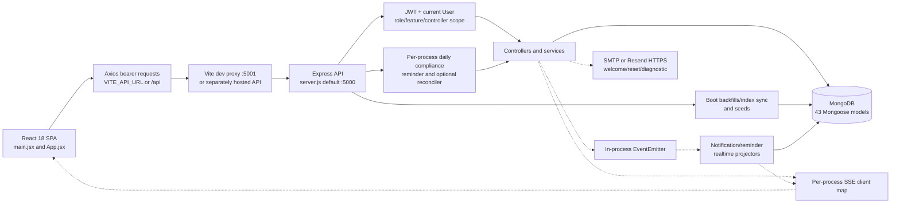
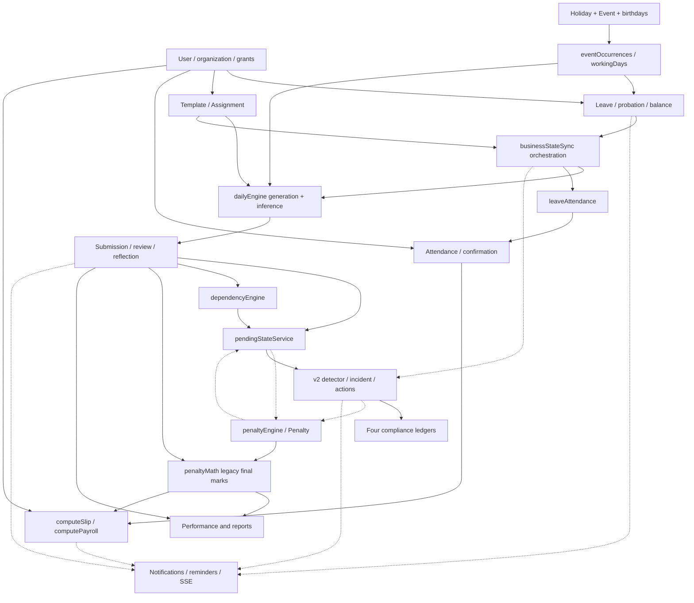
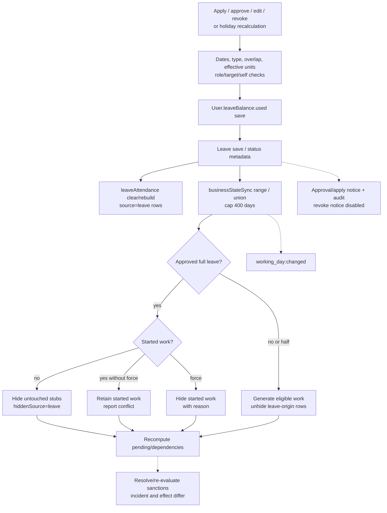
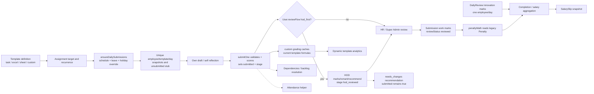
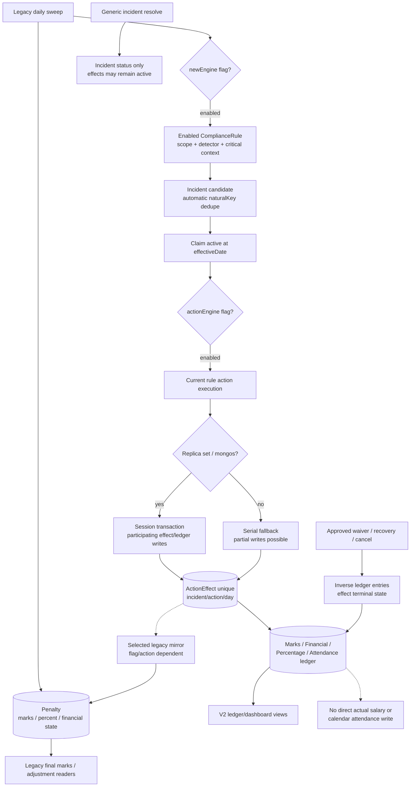
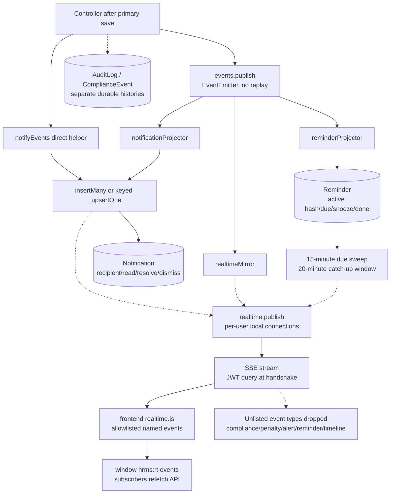

# Architecture diagrams

Eight source-based Mermaid views, snapshot `91aae29`. Solid arrows denote direct calls/data relationships; dotted arrows denote best-effort/derived/conditional effects. They do not imply a transaction. Detailed state, guard and failure semantics are in [Workflows](BUSINESS_WORKFLOWS.md), [Data](DATA_MODEL_AND_SOURCES_OF_TRUTH.md) and [API](API_AND_PERMISSIONS.md).

## 1. High-level architecture



Evidence: server.js, config/db.js, frontend api/axios.js and realtime.js, event subscribers and scheduler services. Render/Vercel are intended hosting assumptions in comments/config, not audited infrastructure. No durable queue/shared realtime bus appears in this runtime.

## 2. Frontend-to-backend request flow

```mermaid
sequenceDiagram
  participant Page as React page
  participant HTTP as Axios
  participant Route as Express router
  participant Guard as auth.js + controller guards
  participant Logic as Controller / orchestrator
  participant DB as MongoDB
  participant RT as Event bus / SSE
  Page->>HTTP: action with JSON or multipart data
  HTTP->>Route: API call + bearer JWT
  Route->>Guard: protect then declared gates
  Guard->>DB: load current active User
  DB-->>Guard: role / HOD / feature configuration
  alt unauthorized or invalid payload
    Guard-->>HTTP: 401 / 403 / validation error
    HTTP-->>Page: error; 401 clears local session
  else permitted
    Guard->>Logic: authenticated request
    Logic->>DB: primary read/write
    DB-->>Logic: saved primary state
    Logic->>DB: secondary writes, often best effort
    Logic-->>RT: domain event / named SSE
    Logic-->>HTTP: JSON or export bytes
    HTTP-->>Page: update/refetch
    RT-->>Page: client forwards supported event types
    Page->>HTTP: refetch current projection
  end
```

Controller ownership/department checks often run inside Logic; the sequence compresses them into Guard for readability. Public auth/reset and diagnostics bypass protect. An accepted primary write can precede a failed secondary operation.

## 3. Module dependency map



The dotted two-way Pending/Legacy relationship is an actual lazy require cycle: penaltyEngine requires pendingStateService inside evaluation helpers; pendingStateService requires penaltyEngine inside resolution helpers. A static local-require scan across228 production backend files found751 edges and this one multi-file strongly connected component. It is not evidence of immediate CommonJS initialization failure because imports are lazy.

Tight coupling: User changes affect assignment cohorts, leave policy, attendance inference, analytics history and payroll. Calendar edits affect balances, stored attendance and work eligibility. Submission status/points affect pendency, sanctions, performance and salary. Shared helpers reduce duplication but do not eliminate different controller formulas.

## 4. Database relationship overview

```mermaid
erDiagram
  USER ||--o{ ASSIGNMENT : "employee target polymorphic"
  DEPARTMENT ||--o{ USER : "current department"
  DESIGNATION ||--o{ USER : "current designation"
  DEPARTMENT ||--o{ DESIGNATION : contains
  USER o|--o{ DEPARTMENT : "hodEmployeeId"
  TEMPLATE ||--o{ ASSIGNMENT : defines
  TEMPLATE ||--o{ SUBMISSION : "snapshot origin"
  ASSIGNMENT o|--o{ SUBMISSION : "assignment ref"
  USER ||--o{ SUBMISSION : owns
  USER ||--o{ DAILY_REFLECTION : "one per day"
  USER ||--o{ DAILY_REVIEW : "one per day"
  USER ||--o{ ATTENDANCE : "one per day"
  USER ||--o{ ATTENDANCE_CONFIRMATION : "one per day"
  USER ||--o{ LEAVE : applies
  LEAVE o|--o{ LEAVE_ATTACHMENT : "orphan then linked"
  LEAVE o|--o{ ATTENDANCE : "leaveId"
  USER ||--o{ SALARY_SLIP : "one per periodKey"
  SUBMISSION o|--o{ DEPENDENCY_TASK : source
  USER ||--o{ DEPENDENCY_TASK : assignedTo
  USER ||--o{ PENALTY : legacy
  SUBMISSION o|--o{ PENALTY : target
  COMPLIANCE_RULE ||--o{ COMPLIANCE_INCIDENT : ruleId
  USER ||--o{ COMPLIANCE_INCIDENT : employee
  COMPLIANCE_INCIDENT ||--o{ ACTION_EFFECT : consequence
  COMPLIANCE_INCIDENT ||--o{ COMPLIANCE_EVENT : history
  COMPLIANCE_INCIDENT ||--o{ WAIVER : request
  COMPLIANCE_INCIDENT ||--o{ RECOVERY : operation
  ACTION_EFFECT ||--o{ LEDGER_ENTRY : "four collections"
  USER ||--o{ NOTIFICATION : recipient
  USER ||--o{ REMINDER : recipient
  USER ||--o{ INTERACTION : "embedded participant"
  INTERACTION ||--o{ INTERACTION_NOTE : notes
  NOTE_TYPE ||--o{ NOTE : classifies
  USER ||--o{ AUDIT_LOG : actor
```



Conceptual cardinalities describe intended refs, not referential constraints. ASSIGNMENT targetRef can instead point to Department or Designation. HOD relationship is stored in both directions with different update paths. LEDGER_ENTRY denotes MarksLedger, FinancialLedger, PercentageLedger and AttendanceLedger. CompanyDocument, AttendanceNote, Contact, Product, Quantity, Dealer, Holiday, Event, InteractionTag, PasswordResetRequest and LeaveConfig are catalogued in the data document; they are omitted here to keep the core relation diagram readable.

## 5. Leave → attendance → submission synchronization



Balance, Leave and secondary models are separate writes. The diagram describes the general controller pattern; rejection has no debit and setBalance is independent. Half→full preflight is defective (D04); a conflict is not always a no-write outcome. LeaveAttendance reads Holiday only while effective units also consume Event holidays.

## 6. Assignment → submission → review → scoring



Custom score caches are not uniformly consumed by generic scoring/payroll. Multiple assignments can coalesce into one daily row. Ordinary HOD needs_changes has no complete return-to-editability transition; penalty reopening is separate. Daily edit/finalization routes have different permission checks from per-submission HOD review.

## 7. Compliance → penalty → ledgers



Waiver/recovery request records and incident promotion are not all in the effect transaction. Partial waiver target relationship checks are missing. A cached runningBalance is not a proven sum. Recurring/escalation loops and backfill/read-shim compatibility are flag-dependent; a completed legacy cutover was not verified.

## 8. Notifications and realtime event flow



`rawResult`/Mongoose8 and notification partial-index incompatibilities affect keyed delivery and reminder create results. No-op helpers intentionally skip many legacy event notifications. Failed subscriber promises are logged; publish does not wait for them or persist retry work.

## Orchestration versus rule ownership

- **Orchestration:** businessStateSync coordinates attendance/work/pending/compliance and SSE; dailyComplianceScheduler/ruleEvaluationScheduler coordinate detection and execution; controllers coordinate request validation and writes; projectors coordinate downstream delivery.
- **Rules:** dateHelpers/effectiveLeaveDays and eventOccurrences define calendar/unit semantics; leaveAccounting defines paid-override arithmetic; scheduleHelpers defines recurrence; pendingStateService defines task pending predicates; customTemplate/payroll/penaltyMath define different scoring/money calculations; detector/action registries define compliance behavior.
- **Duplication/conflicts:** submission/review/daily edit score recalculation; custom caches versus legacy points; Holiday-only synchronization versus unified calendar; legacy and v2 sanction readers; salary generation versus editing; enabled-only route gate versus configured action permissions. A shared helper's presence does not guarantee all call sites use it.
